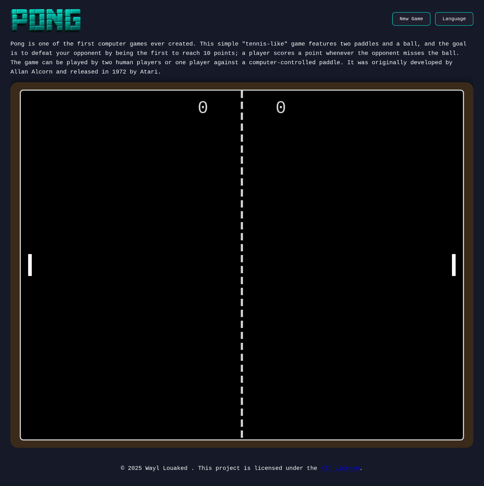

# 🏓 Pong
A classic Pong game developed in TypeScript with intelligent opponent AI.

<p align="center">
  
</p>

## 📋 Description
This project is a modern reimplementation of the famous Pong game. Face off against an AI that reacts to ball movements and try to score as many points as possible!

## 🎯 How to Play
- Use the **↑** and **↓** keys to move your paddle
- Prevent the ball from passing your side

## Clone the repository
```bash
git clone git@github.com:louakedwayl/pong.git
```

## 🛠️ Installation
```bash
make
```

## Access the game
```bash
http://localhost:4243/
```

## 📝 License
© 2025 Wayl Louaked. This project is licensed under the MIT License.
